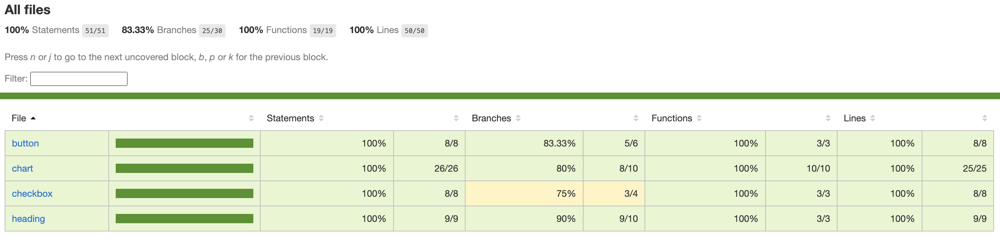

# 日本の人口推

***プロジェクト名：日本の人口推移を可視化するReact SPAです。***

## 開発環境セットアップ
- Node.js: 22.3.0

## 技術スタック
- React
- TypeScript
- Vite (SWCコンパイラー)
- CSS [^1]
[^1]: CSSのネスト記法を使用してスタイルを適用します

## 利用ライブラリ
### データ可視化のグラフライブラリ
- Highcharts
- Highcharts-react-official

### テストライブラリ
- jest
- react-testing-library [^2]
[^2]: JestとReact Testing Libraryを使用してテストします

### フォーマットライブラリ
- Prettier

## 開発環境のセットアップ

1. リポジトリのクローン
   ```
   git clone [リポジトリのURL]
   ```

2. 依存関係のインストール
   ```
   npm install
   yarn install
   pnpm install
   ```

3. 開発サーバーの起動：
   ```
   npm run dev
   yarn dev
   pnpm dev
   ```

## 他の利用可能なスクリプト

- `npm run dev`: 開発サーバーを起動します
- `npm run build`: プロダクション用にアプリケーションをビルドします
- `npm run lint`: ESLintを使用してコードをリントします
- `npm run preview`: ビルドされたアプリケーションをプレビューします
- `npm run format`: Prettierを使用してコードをフォーマットします
- `npm run test`: Jestを使用してテストします[^3]
[^3]: テストコードは`test/`ディレクトリに格納されており、`pnpm test`で実行して`/coverage`でcoverageを確認できます

## 参考URL
### スタック
- [React](https://react.dev/)
- [Vite](https://vitejs.dev/)
- [SWC](https://swc.rs/)

### データ、API関連
- [RESAS API](https://opendata.resas-portal.go.jp/)
- [RESAS API 仕様書](https://opendata.resas-portal.go.jp/docs/api/v1/index.html)

### グラフ関連
- [Highcharts](https://www.highcharts.com/)
- [Highcharts-react-official](https://github.com/highcharts/highcharts-react)

### フォーマット関連
- [Prettier](https://prettier.io/)
- [ESLint](https://eslint.org/)

### UI関連
- Checkbox: [Codepenソース](https://codepen.io/north-of-rapture/pen/rWqega)
- ReactのHighcharts例: [Codepenソース](https://codepen.io/search/pens?q=react+highcharts)

### favicon
- [Canva](https://www.canva.com/ja_jp/): 無料のfavicon素材を使用しています

### トラブルシューティング関連
- prettierの設定関連：[eslint-config-prettier](https://github.com/prettier/eslint-config-prettier)
- prettierの設定関連：[eslint-plugin-prettier](https://github.com/prettier/eslint-plugin-prettier)

## テストCoverage
